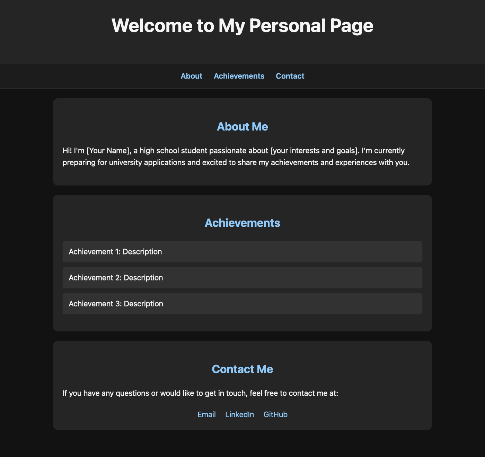

# about-me
A template for creating a dark mode website about oneself.

Simply insert plain text into the pre-made input lines, and voila! You now have a dark mode webpage made for yourself, to which you can connect a URL domain.

A single HTML file with no JavaScript, frameworks, or build step. It works on phones and desktops, and shows a proper preview card when the link is shared.

## How to use
1. Download `About_Me.html`.
2. Open it in any text editor and search for `EDIT`. Each marked spot tells you what to change: your name, introduction, achievements, contact links, and the tab icon's initials.
3. Open the file in a browser to check how it looks.
4. *(Optional)* To add a profile photo, put the image in the same folder and uncomment the `` line in the header.

## Hosting it for free with GitHub Pages
1. Create a new public repository on GitHub.
2. Upload `About_Me.html` and rename it to `index.html`, so it loads as the site's home page. Upload your photo too if you use one.
3. In the repository, go to **Settings → Pages**, set the source to **Deploy from a branch**, choose `main`, and save.
4. After a minute or two, your page is live at `https://<your-username>.github.io/<repository-name>/`.
5. *(Optional)* To use your own domain, enter it under **Custom domain** on the same settings page and follow GitHub's instructions for your domain provider's DNS settings.

Once it is live, update the `og:url` line in the file to your page's address so link previews point to the right place.
